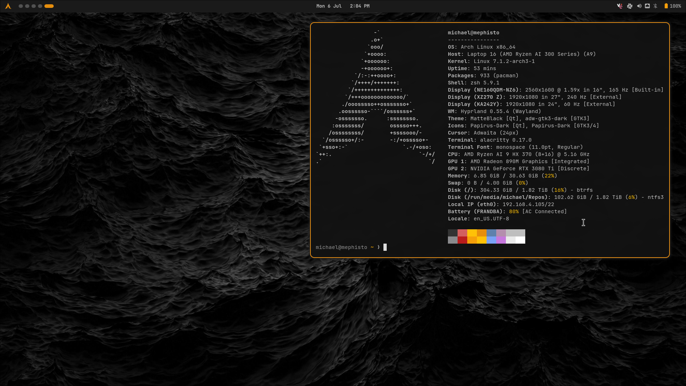

# dotfiles

Framework 16 · Arch · Hyprland · Quickshell — managed with [GNU Stow](https://www.gnu.org/software/stow/).



## About
This is my personally managed dotfiles for my Arch Linux installation. It comes with my Quickshell bar (per-module drawers for bluetooth, network, audio, display and power), GTK color overrides, my custom Kvantum theme, and a helper script for searching the local `arch-wiki-docs` for LLM searching.

## Packages
- `hypr`       → `~/.config/hypr`        (Hyprland Lua config)
- `quickshell` → `~/.config/quickshell`  (bar: per-module drawers -- bluetooth, network with live stats, audio, display, power)
- `localbin`   → `~/.local/bin`          (helper scripts; `wifi-connect` uses `zenity` for password prompts; `network-probe` / `wifi-band` feed the network drawer)
- `webapps`    → web2app PWA launchers + icons
- `shell`      → zsh/bash rc files
- `gtk`        → `~/.config/gtk-3.0`, `~/.config/gtk-4.0`  (matte-black GTK3/GTK4 overrides)
- `qt`         → `~/.config/{qt5ct,qt6ct,Kvantum}`         (Kvantum matte-black for Qt5/Qt6)
- `uwsm`       → `~/.config/uwsm/env`                      (login-phase env; activates the Qt theme)
- `alacritty`  → `~/.config/alacritty`                     (matte-black terminal; JetBrainsMono Nerd Font)
- `etc`        → `/etc/NetworkManager/conf.d` (root; applied by `make dns`, not stowed)

Not stowed: `etc/` (root config, applied by `make dns`) and `tests/` (`make test` runs the pure-JS models behind the bar).

## Deploy on a new machine
```sh
sudo pacman -S --needed stow git zenity adw-gtk-theme papirus-icon-theme kvantum kvantum-qt5 qt5ct qt6ct hyprland quickshell
git clone git@github.com:sipesdev/dotfiles.git ~/Projects/dotfiles
cd ~/Projects/dotfiles && bash install.sh   # or: make stow
make dns                                    # root: Cloudflare DNS for every connection (etc/NetworkManager/conf.d/20-dns.conf)
```

`make dns` installs the NetworkManager global-DNS override (`1.1.1.1` / `1.0.0.1`, overriding
DHCP for every present and future connection -- no switcher by design) and reloads NetworkManager.
Verify with `grep nameserver /etc/resolv.conf`; if the reload did not take, `sudo systemctl restart NetworkManager`.

## License
Released under the [GNU General Public License v3.0](LICENSE).